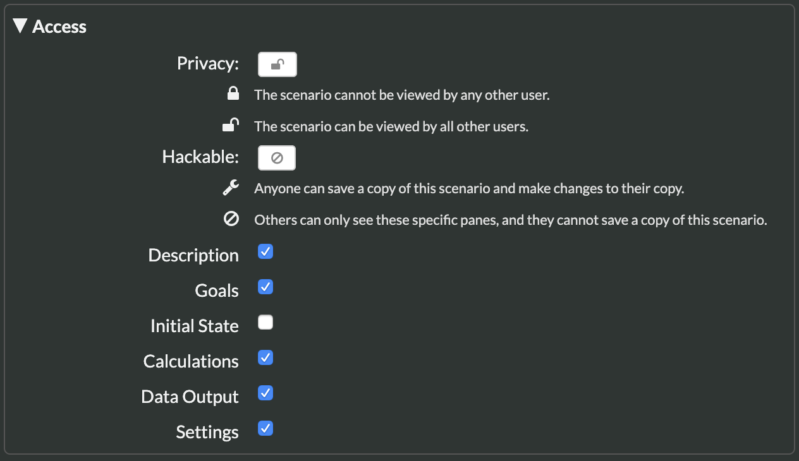
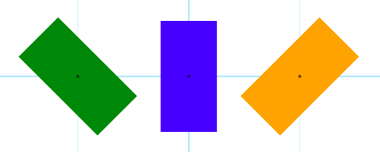

# Change Log

## 2020-2-28

### Changed

#### Collision Functions

We have greatly enhanced two functions for helping model collisions. Collision detection and resolution are typically quite difficult for students to program. We have added the ability to detect as well as assist in the modeling of collision resolution much easier.  The functions and how they have been enhanced are listed below:

* `hasCollided(source, target)`:   This function takes two objects \(`Particle` or `Block`\) as its arguments and then returns true or false if the two objects are overlapping.   
* `getIntersect(source, target)`:   This function returns a two dimensional matrix representing the minimum translation vector \(MTV\) that would be needed to separate two objects when they overlap. This can be used to simulate collision forces based on the magnitude and direction of the MTV.

For some good examples of how these functions can be used to model realistic collisions, check out these demonstrations:

* [Demo: Particle In A Box](https://www.tychos.org/en/scenarios/sae23y)
* [Demo: Modeling Collisions With An Elastic Force](https://www.tychos.org/en/scenarios/vugK2C)

####  General Download Speed Increases

We have made some significant improvements in load times for Tychos when you first visit the site due to utilizing some caching and compression technologies. We hope you appreciate the faster loading times! 

## 2020-1-13

### Changed

#### **Moved Tychos servers**

We have moved Tychos.org to different servers to improve reliability and monitoring. Tychos was unavailable for half a day—we apologize for that. Now that we have created this change history for Tychos, we will announce maintenance issues here.

## 2020-1-03

### Fixed

#### Settings Pane crashing for some scenarios

Some scenarios were crashing when the Settings pane was opened. We found the problem and now all scenarios should have an accessible Settings pane.

## 2019-11-25

### Added

#### **Hide/Show Panes:**

Teachers can now hide different panes in order to more finely control access to different aspects of scenarios. In the Settings Pane, there is now an Access sub pane that allows you to show or hide one of the Hack Panel's panes:



## 2019-11-9

### Added



#### **Labels:**  

You can now add a Label object to your simulations. This gives users the ability to add and then animate text in the Tychos world.    
  
You can create text in any RGB color and define its size and position:  
  
`myLabel = Label(position=[0, 0], size=[100, 100], “text”, “green")`  
  
You can then rotate the text as well:  
  
`myLabel.rotate(PI/4)`  
  
Particle and Block objects can also be given a text labels. This is similar to the Label object.  
  
`particle.addLabel(text="Hello", color="green")`  
  
To learn more, check out our documentation here:  
  
[https://docs.tychos.org/docs/learn/language-reference-api\#label](https://docs.tychos.org/docs/learn/language-reference-api#label)  


#### **Some New Useful Functions:**

We have added some new useful functions. Here is a list of those functions and briefly what each one does: 

* `stop(test=false)` :   Allows you to stop the simulation if a condition is met. The input can be any logical statement that can be evaluated to true or false.  
* `hasCollided(p1 = Particle, p2 = Particle)`:   This function takes two Particle objects as its arguments and then returns true or false if the two Particles are overlapping. This function only works with particles at this time, but we plan on building in more sophisticated collision detection for blocks too!   
* `getIntersect(source, target)`:   This function returns a two dimensional matrix representing the minimum translation vector \(MTV\) that would be needed to separate two Particle objects when they overlap. This can be used to simulate collision forces based on the magnitude and direction of the MTV.
* `polar(radius, angle, units=”rad”)`:   This function is a utility function for quickly defining a 2d vector in polar form. It takes two required arguments, the scalar angle, and the scalar radial length. You can optionally include a tag of “deg” or “rad” to identify the angular units. The default value for units is “rad” for radians.

#### **Code Presentation Mode**

In the Settings Pane, you can now choose a new code color scheme that is better for presentation. Besides these changes we have added some other UI enhancements like better tooltips for the output gutter in the Initial State pane and the Calculations pane as well as a more organized Settings Panel. We hope you like the changes, and we are always looking for feedback and ideas on how to make Tychos better. A huge thanks to all the users that have contacted us and given us some great ideas!

### Changed

#### **Graph Enhancements** 

We have added some new enhancements to graphs:

* Graphs are now resizable so that you can make them larger or smaller on the screen.
* You can alternatively “roll” up the graph into the panel title bar.
* We have added tooltips for the data points in the graphs.

## 2019-8-19

### Added

#### **Data Output Table:**

This is has been a feature that we have wanted to add for quite some time, and we have an initial version ready for you! With just a few lines of code, you can now create a data table for displaying variable values. This can be really helpful for recording a history of the simulation. We think this is a crucial tool for helping students connect the code they write to the simulation animation. You can create a data table by setting the columns in the Initial State Pane like this:

  `table.setColumns(["column1", "column2", ...])`  

Where the array of strings `"column1"` and `"column2"` would be the table column headers. You must have a table with at least one column, but you can have many more. Then you can record a new row in the table using this command in the Calculations Pane: 

`table.addRow([val1, val2, ...])`  

Where the array of values for example - `val1` and `val2` - could be any variable values you would like to record. The array of values must have the same number of values as columns in the table.  


#### **Mouse Interactivity**

You can now get the position of the mouse mapped to the simulation extents. This allows you, for example, to build interactive simulations where Particles or Blocks can respond to the mouse position. To do so, you simply just need to reference the mouse position like this:  `mouse.pos`  This will return the mouse position within the scenario coordinate system. We have also added the ability to detect “mouse over” events. The following function allows you to test if the mouse is over a Particle or a Block:

```text
# Where p is a Particle, but could be a Block too!
mouse.is_over(p)  
```

Here is a demonstration to check out these the new mouse interaction features:

 [https://tychos.org/scenarios/nQqTE7](https://tychos.org/scenarios/nQqTE7) 

