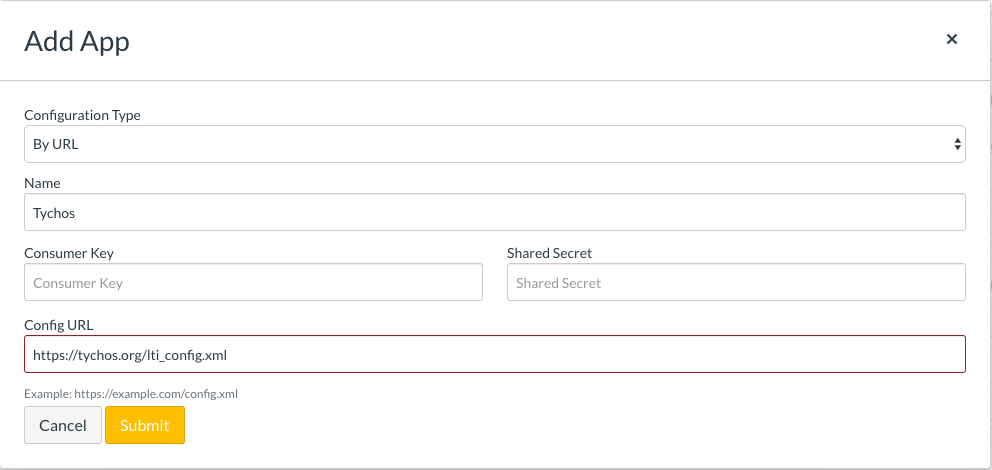

# Canvas LTI Installation Guide

## Tychos Works with Instructure Canvas 

### What's good about Canvas LTI Apps? 

When using LTI, Canvas will tell Tychos who is logged in. This allows your students to save copies of your master scenario under their name. If the same student clicks the module again in Canvas, they will get their last saved version of the Scenario instead of the master scenario.

### Adding Tychos as a Canvas LTI App 

This app can be installed as an LTI plugin with Instructure Canvas. Here is how to do it:

* In Canvas, go to Settings &gt; Apps &gt; View App Configurations
* Click the blue "+" button. You should see the Add App form.
* For the **Configuration Type** choose **By URL**.
* For the **Configuration URL** use this URL: **https://tychos.org/lti\_config.xml**

The **Add App** form should look like this:

### Adding a Tychos Scenario to a Canvas Module \(or as an Assignment\) 

* Go to the Scenario you want to add. Take a note of the code at the end of the your URL. E.g. tychos.org/scenarios/xxxxxx means your scenario id id **xxxxxx**.
* In Canvas, go to Modules &gt; "+" Button. You should see the Add Item to... popup. Choose:
* Add: **External Tool**
* Click on **Tychos**. Notice the URL gets filled in with a URL ending with `...tychos.org/lti`
* **URL**: Add your scenario code from above to the end of the URL, e.g. `...tychos.org/lti/xxxxxx`
* **Page Name**: copy the name of your Scenario
* Click Add Item

