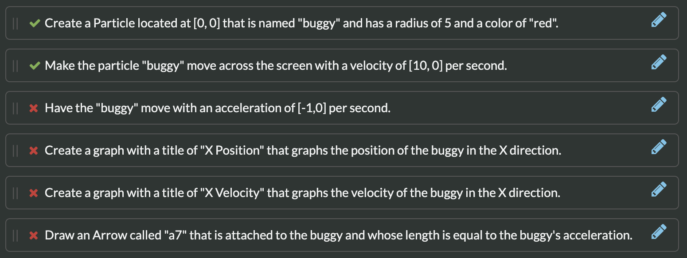
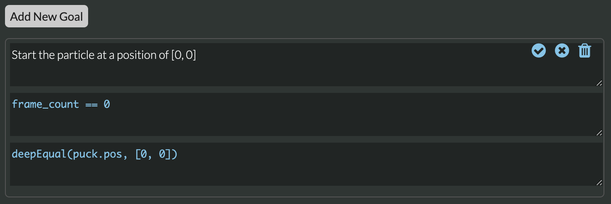
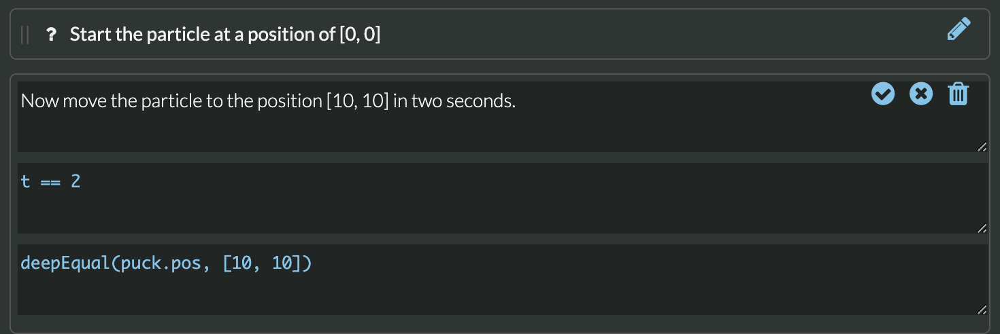
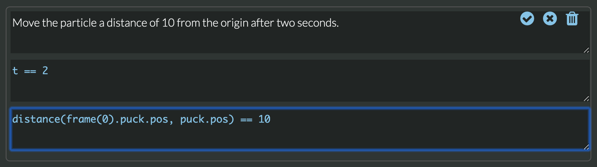

# Writing Goals

## Overview <a id="writing-goals"></a>

A _Goal_ in Tychos is a short piece of code in a _scenario_ which can check a student's work. Goals are written by the scenario's author, usually an instructor. To the student, the goals appear as a sentence describing something the student should do. At a time defined within the goal, the goal is "checked" and if the goal is satisfied, it turns green. Otherwise it turns red. If the goal's state has not yet been "checked" it will display a question mark.



## Writing a Goal

In order to write a goal, you need to be logged in as an Instructor. Only instructors see blue pencil edit buttons at the right side of the goal. Goals can be dragged up or down to reorder the goals. This does not affect when they are checked, but just as a way for you to change how they re being presented to the students.

When you click the pencil button to edit a goal, the goal turns into three edit boxes. The blue pencil button changes to three buttons:

* A "check" button for saving the goal
* An "x" for closing the edit boxes without saving them.
* A "trashcan" button for deleting the goal.

Each edit box represents the three parts of a goal - \(1\) a **description** which the student sees, \(2\) a **when condition** which specifies at what time the goal will be checked, and \(3\) the **victory condition** which specifies what value the student is supposed to create. Here is a simple Goal:



In this case the Goal is:

1. **Description**_:_ "_Start the particle at a position of \[0, 0\]_
2. **When Condition:** "_`frame_count == 0`"_
3. **Victory Condition**: "`deepEqual(puck.pos, [0, 0])`"

The above goal's **when condition** is fired when the  `frame_count` is 0, which causes the **victory condition** to be checked right after the _initial state_ code is run, and before the first _calculations_ code is run. To satisfy this goal, the student can write this:

```text
# Intial State
puck = Particle([0, 0], 5, "green")
```

The initial position of the puck is \[0, 0\] before the simulation begins - this is frame 0. The `frame_count` variable allows you to track the frame of the simulation.


In the above Goal's **victory condition** code, you can see that we used the function `deepEqual` to see if the position of the puck particle is `[0, 0]`. When comparing matrices for equivalency, you need to use `deepEqual`.


If the student were to then write this code in the **Calculations Pane**:

```text
# Calculations
puck.pos = [1, 1]
```

The **victory condition** would still be met because this would change the particle's position after the initial conditions have already been tested at frame 0. 

Here is another goal that will check that a student has moved the particle to a new position:



In this case the Goal is:

1. **Description**_:_ "_Now move the particle to the position \[10, 10\] in two seconds._
2. **When Condition:** "_`t == 2`"_
3. **Victory Condition**: "`deepEqual(puck.pos, [10, 10])`"

The above goal's _**when condition**_ is fired when `t` is 2, which causes the **victory condition** to be checked at the moment the simulation reaches a time of 2 seconds. This example demonstrates that you can choose either to trigger the Goal test using a specific frame, or a time in seconds.

You could also set the **when condition** using a comparison operator. This would allow you to test your goal state every frame as long as the **when condition** were set:

```text
# When Condition
t > 2
```

## Frame History

When writing goals it is often useful to compare a variable's value. Tychos provides a way to access all the variables defined in the simulation at any frame. To access a frame, you can simply type:

```text
frame(10)
```

This captures all the variables at frame 10. To access an object and its properties \(for example, the position\) you simply use the "dot" notation:

```text
# Access the "puck" particle's position at frame 10
frame(10).puck.pos
```

This allows you to compare attributes of various objects or variables from one frame to another. So for example we can test to see if the "puck" particle has moved a certain distance by a specified time:



In this case the Goal is:

1. **Description**_:_ "_Move the particle a distance of 10 from the origin after two seconds."_
2. **When Condition:** "_`t == 2`"_
3. **Victory Condition**: "`distance(frame(0).puck.pos, puck.pos) == 10`"

The **victory condition** in this case calculates the distance between the position of the "puck" particle's position at frame 0 and the current position of the "puck" particle when the time is 2 seconds.

You could also use frames to test if a particle is moving in a specific direction:

```text
# Is the puck moving in the positive X direction?
frame(1).puck.pos[X] > frame(0).puck.pos[X] >
```

Or you could even test if the puck particle is accelerating:

```text
# Is the puck accelerating in the positive X direction?
(frame(1).puck.pos[X] - frame(0).puck.pos[X]) < (frame(2).puck.pos[X] - frame(1).puck.pos[X]
```

## Tips When Writing Goals

* Use the logical operators `and` and `or` to combine conditions. This can be helpful in making sure that something is meeting two different conditions, or could be meeting one of two \(or three, etc.\)
* The `between` function is useful to see if a variable value is in a range. It makes writing some victory conditions a bit easier.
* Try to use the built in attributes of objects in your victory conditions because then you can be guaranteed that the Particle, Block, etc has those attributes. For example, testing to see if an object is accelerating can be done using frame comparisons of positions \(see above\).
* Make sure that you test your own goals. You can also test your victory conditions in the Calculations Pane as a way to see if the condition code is working.

