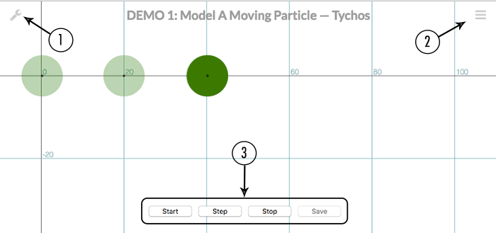

# Interface Overview

## World View

The main application screen shows the simulated world filled with particles, and any graphs that have been defined. The main window primarily consists of a two dimensional grid that represents a limitless two dimensional euclidean space. This is the space where all simulation animations take place.

