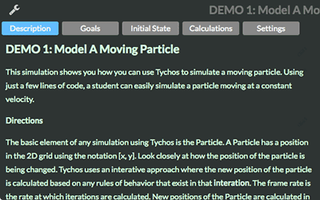
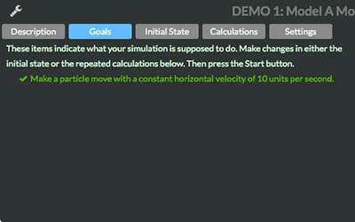

# The Interface

## World View

The main application screen shows the simulated world filled with particles, and any graphs that have been defined. The main window primarily consists of a two dimensional grid that represents a limitless two dimensional euclidean space. This is the space where all simulation animations take place.

There are several key user interface elements on the screen that serve important functions for accessing different aspects of the application:

1. Wrench Icon - click on this to access the editing and settings panel for your simulations.
2. Links Menu - click on this to access links to other content on our website.
3. Simulation Controls - these are the controls for starting, stepping through, stopping or saviing your simulation.

## Simulation "Hack" Panels

The panels shown below are accessed by clicking the small wrench icon in the upper left hand corner of the screen. Each panel has its own function with different information displayed and often editable by the user.

### **Description Panel**

This is the description of the simulation, as well as any optional directions that can be identifed by the simulation author.

### Goals Panel

The instructor or whoever wrote the scenario may include specific goals that the student should accomplish with this Scenario. Each goal has a description such as "Make particle p1 move to the right" and the goal will turn green when your program achieves that goal.

### **Initial State Panel**

You program the initial conditions of the simulation, e.g. creating particles, setting their initial position, creating graphs to view particular aspects of your simulation, and perhaps defining initial values such as the gravity or mass. The code that you write appears on the right of the screen, while each line of code is evaluated and its output appears on the left in blue text. You can learn more about what kind of code can be written in this pane by visiting the [Language Reference](https://staging.tychos.org/doc/learn/reference.html)

**Indentation** — Indent several lines of code by selecting them and typing `Cmd-]` or `Tab`. Unindenting is `Cmd-[` or `Shift-Tab`.

**Comments** — Comment lines by selecting them and typing `Cmd-/` or `Ctrl-/`.

### **Calculations Panel**

In this panel, you write your program for calculating what the simulation does for every moment in time as the simulation runs - called a frame. E.g. for a simulation of particles moving in space, you might examine several particles and calculate a new position for them given their existing momentum. Just as in the **Initial State** pane, the code that you write appears on the right of the screen, while each line of code is evaluated and its output appears on the left in blue text. You can learn more about what kind of code can be written in this pane by visiting the [Language Reference](https://staging.tychos.org/doc/learn/reference.html)

### **Settings Panel**

This pane allows you to change several settings of the simulation:

* A button for displaying or hiding a **Motion Map**
* A slider for adjusting the frame rate.
* A slider for adjusting the motion map's strobe rate.
* An input box for setting the amount of time the simulation runs. A value of -1 tells the simulation to run indefinitely.
* There are several settings for adjusting how the World View is displayed. The World View window can either scale automatically depending on the space inhabited by any particles, or it can be set to a specific viewing size.

