# Tychos Language Reference

The following reference guide identifies the language syntax, built in variables, functions, and classes that are used to code your simulations in Tychos. Tychos uses the [MathNotepad language](http://mathnotepad.com/docs/functions.html). We have included documentation here for some of the helpful functions defined in the MathNotepad language. This is not a complete list of all functions available in MathNotepad, just ones that might be commonly used in Tychos for building scenarios as well as defining goals for those scenarios.

## Comments

Comments are statements that you can insert in your code that do not get interpreted and executed by Tychos. To create a comment, you simply indicate a comment by using a hashtag:

```text
# This is a comment.
```

## Variables

To define a variable in Tychos all you need to do is identify a name for the variable. You then type an `=` sign to assign a value to the variable. The following demonstrates various variable declarations

```text
# Assigns a variable called x the value of 10
x = 10

# Assign a new variable y the value of the x
y = x

# Assign x the value of itself plus 1
x = x + 1
```

## Built-in Scenario Variables

There are a few variables that are built into Tychos. These variables are:

* `t` — How many seconds has passed since this Scenario was started?
* `dt` — Time between frames as seconds, e.g. 0.1 is 1/10th of a second.
* `frame_count` — How many frames have passed? e.g. 1, 2, 3...
* `X`, `Y` — These are shortcuts for indexing the first two elements of 2-D matrices, e.g. `my_particle.pos[X]`

## Common Math Operators and Functions

These are some common mathematical operators and functions for performing various calculations.

### Mathematical Operators

Tychos uses the following operators to perform basic math calculations:

* `+` — Addition
* `-` — Subtraction
* `*` - Multiplication
* `/` - Division
* `^` - Exponent
* `%` - Modulo

### Basic Math Functions

You can also use the following basic math functions:

#### **base ^ power**

The `pow(base, power)` function takes two arguments, raising the `base` by the `power`.

```text
# returns number 8
2 ^ 3
```

#### **sqrt\(positive\_number\)**

The `sqrt(positive_number)` function takes a single non negative number and returns the real square root of the number.

```text
# returns number 2
sqrt(4)
```

#### **abs\(number\)**

The `abs(number)` function returns the absolute value of a number.

```text
# returns number 2
abs(-2)
```

### Trigonometric Functions

The following functions all use radians as the angle measurement. You can use `pi` to represent PI.

#### **sin\(angle\)**

The `sin(angle)` function is used to evaluate the trigonometric sine value for a given input angle. The input angle must be provided in radians.

```text
# returns number 1
sin(pi/2)
```

#### **cos\(angle\)**

The `cos(angle)` function is used to evaluate the trigonometric cosine value for a given input angle. The input angle must be provided in radians.

```text
# returns number 1
cos(0)
```

#### **tan\(angle\)**

The `tan(angle)` function is used to evaluate the trigonometric tangent value for a given input angle. The input angle must be provided in radians.

```text
# returns number 1
tan(pi/4)
```

#### **asin\(value\)**

The `asin(value)` function is used to evaluate the trigonometric arcsine value \(inverse sine\) for a given input. The output angle is given in radians.

```text
# returns number 1.57
asin(1)
```

#### **acos\(value\)**

The `acos(value)` function is used to evaluate the trigonometric arccosine value \(inverse cosine\) for a given input. The output angle is given in radians.

```text
# returns number 0
acos(1)
```

#### **atan2\(X, Y\)**

The `atan2(value)` function is used to evaluate the trigonometric arctangent value \(inverse tangent\) for a given X and Y input. The output angle is given in radians.

```text
# returns number -0.785
atan2(-1, 1)

# returns 2.36
atan2(1, -1)
```

#### **deg\_to\_rad\(angle\)**

The `deg_to_rad(angle)` function is not part of the MathNotepad language but is provided as a helper function to make the conversion from degree angles to radians easier. The input is an angle measurement in degrees and the output is the angle measurement in radians.

```text
# returns number .785
deg_to_rad(45)
```

#### **rad\_to\_deg\(angle\)**

The `rad_to_deg(angle)` function is not part of the MathNotepad language but is provided as a helper function to make the conversion from radian angles to degrees easier. The input is an angle measurement in radians and the output is the angle measurement in degrees.

```text
# returns number 180
rad_to_deg(p1)
```

### Matrix Functions

The following functions provide operations for matrix calculations.

#### **dot\(x, y\)**

Calculates the dot product of two vectors. The dot product of `x = [a1, a2, a3, ..., an]` and `y = [b1, b2, b3, ..., bn]` is defined as:

`dot(x, y) = a1 * b1 + a2 * b2 + a3 * b3 + … + an * bn`

```text
# Work is the dot product of Force (F) and displacement (r)
F = [2, 2]
r = [3, 3]

# returns 12
Work = dot(F, r)
```

#### **cross**

Calculates the cross product for two vectors in three dimensional space. The cross product of `x = [a1, a2, a3]`and `y = [b1, b2, b3]` is defined as:

`cross(x, y) = [ a2 * b3 - a3 * b2, a3 * b1 - a1 * b3, a1 * b2 - a2 * b1 ]`

If one of the input vectors has a dimension greater than 1, the output vector will be a 1x3 \(2-dimensional\) matrix.

```text
# Torque is the cross product of Force and moment arm (r)
F = [2, 0, 0]
r = [0, 2, 0]
# returns matrix [0, 0, 4]
cross(F, r);
```

## Other Useful Functions

Some other useful functions...

#### **random\(min, max\)**

Return a random number larger or equal to min and smaller than max using a uniform distribution. If now min or max are given, then it returns a random value from 0 to 1. If just one value is given, then it returns a random number between 0 and the input value.

```text
random()       # returns a random number between 0 and 1
random(100)    # returns a random number between 0 and 100
random(30, 40)  # returns a random number between 30 and 40
random([2, 3])  # returns a 2x3 matrix with random numbers between 0 and 1
```

#### **drawArrow**

The `drawArrow` function draws an arrow and is commonly used to illustrate vectors for a particle. drawArrow should be called in the Calculations editor because it only draws the arrow for the current frame. If you call drawArrow\(\) in the Initial State editor, you will not see anything.

`drawArrow(pos=[0,0], size=[1,0], color="black", components=false, thickness=1)` -&gt; returns and draws an Arrow object

* `pos` — coordinates for the starting point of the arrow as an \[X,Y\] matrix.
* `size` — the vector to illustrate, e.g. \[10, 0\] will draw an arrow 10 units to the right.
* `color` — Optional HTML color value for your arrow, e.g. "red" or "\#ff0000".
* `components` — Optional flag that determines if vector components are drawn, a value of `true` displays the components.
* `thickness` — Optional stroke value that determines the visual thickness of the arrow.


Example — The illustrations above were drawn using these commands:

```text
# Initial State editor
p = Particle([0,0], 10, "green")

# Calculations editor
drawArrow(p.pos, [20, 20], "purple")        # just the diagonal arrow
drawArrow(p.pos, [20, 20], "purple", true)  # also draw X and Y components
```

#### **drawLine**

The `drawLine` function draws a line and is commonly used to illustrate some connecting member like a string or cable, but could really represent anything you like. `drawLine` should be called in the Calculations editor because it only draws the line for the current frame. If you call `drawLine` in the Initial State editor, you will not see anything.

`drawLine(pos=[0,0], pos2=[10,0], color="black", thickess=1)` -&gt; returns and draws an Line object

* `pos` — coordinates for the starting point of the line as an \[X,Y\] matrix.
* `pos2` — the coordinates of the end point of the line as an \[X,Y\] matrix.
* `color` — Optional HTML color value for the line, e.g. "red" or "\#ff0000".
* `thickness` — Optional stroke value that determines the visual thickness of the line.

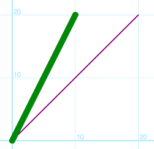

Example — The illustration above was drawn using this command:

```text
# Calculations editor
drawLine([0, 0], [20, 20], "purple", 2)  # a line
drawLine([0, 0], [10, 20], "green", 10)  # another line
```

#### **unit\_vector**

This function returns a unit vector representation of the given input vector. Its magnitude is 1 and the direction matches the direction of the input vector. This can be useful if you need just the direction of a vector, but not its magnitude.

`unit_vector(vec)` -&gt; returns a vector of length 1, and in same direction as `vec`.

* `vec` - any two dimensional vector as a \[X, Y\] matrix.

Example:

```text
u = unit_vector([3, 4])  # returns [0.6, 0.8]
magnitude(u)             # returns 1
```

#### **magnitude**

This function returns the scaler magnitude of any given vector. This is helpful when you want to know the length of a vector, for example, if you want the magnitude of a vector, but not its direction.

`magnitude(vec)` -&gt; returns the scaler magnitude of the vector `vec`.

* `vec` - any two dimensional vector as a \[X, Y\] matrix.

Example:

```text
magnitude([3, 4])             # returns 5
```

#### **direction**

This function returns a scalar angle measurement. This is helpful when you want to know the direction of a vector, like the direction of a velocity vector, or the direction of a force vector. The default return angle is given in radians, but can also be expressed in degrees.

`direction(vec, units="rad")` -&gt; returns the scaler angle measurement of the vector `vec` heading in radian form or in degree form.

* `vec` - any two dimensional vector as a \[X, Y\] matrix.
* `units` - optional `deg` for degree measurement or the default of `rad` for radians. 

Example:

```text
direction([4, 4])             # returns .785
direction([4, 4], "deg")        # returns 45
```

### Comparison Functions

The following functions are used to compare two values as being equal or unequal as well as testing if one value is larger or smaller than another. These are very helpful when writing goals for students.

#### `equal(a, b)` **or** `a == b`

The function tests if two values \(x and y\) are equal. It returns a boolean value of `true` or `false`.

```text
2 + 2 == 3             # returns false
2 + 2 == 4             # returns true
t == 10                # returns true if t is 10, or false if it is not.
equal(2 + 2, 4)        # same as 2 + 2 == 4
```

#### **deepEqual\(a, b\)**

This function is similar to `equal`, but it tests element wise whether two matrices are equal. It returns a boolean value of `true` or `false`. The code below demonstrates the difference between `equal` and `deepEqual`:

```text
p1 = Particle([10, 10])
p2 = Particle([10, 0])

deepEqual(p1.pos, p2.pos)   # returns false
equal(p1.pos, p2.pos)       # returns [true, false]
```

#### `larger(a, b)` or `a > b`

The function tests if one value \(a\) is larger than another \(b\). It returns a boolean value of `true` or `false`.

```text
2 > 3               # returns false
3 > 2               # returns true
2 > 2               # returns false
larger(2, 2)        # same as 2 > 2
```

#### `smaller(a, b)` or `a < b`

The function tests if one value \(a\) is smaller than another \(b\). It returns a boolean value of `true` or `false`.

```text
2 < 3                # returns true
3 < 2                # returns false
2 < 2                # returns false
smaller(2, 2)        # returns false
```

#### `unequal(a, b)` or `a != b`

The function tests if two values \(a and b\) are unequal. It returns a boolean value of `true` or `false`.

```text
2 + 2 != 3              # returns true
unequal(2 + 2, 3)       # true -- same as 2 + 2 != 3
2 + 2 != 4              # returns false
t != 10                 # returns false if t is 10, or true if it is not.
```

Comparison operators return `true` or `false` but these also evaluate to 1 \(true\) or 0 \(false\). This can allow you to conditonally assign a value to a variable depending on the evaluation of the comparison. See the code below as an example:

```text
# If t is larger than 10, then the value of F is [10, 10], otherwise it is 0.
F = (t > 10) * [10, 10]
```

#### `if(test, true_result, false_result)`

The `if()` function returns `true_result` or `false_result` depending on `test`.

```text
if(true, 3, 44)                 # returns 3
if(false, 3, 44)                # returns 44
if(1 > 2, 3, 44)                # test is false; therefore returns 44
a = 1
b = 1
if(a == b, "YAY", "darn")       # test is true; therefore returns "YAY"
```

### Logical Operators

The following operators are used to execute logical AND and OR comparisons for the use of evaluating logical statements.

#### **and**

This is used for performing a logical AND conjunction. For example, "A and B" is true only if A is true and B is true. "A and B" is false if either A or B is false.

```text
A = true
B = true

A and B # returns true

B = false

A and B # returns false
```

You can use the `and` operator to test if two comparisons are both true:

```text
x = 2

(x < 3) and (x == 2)  # returns true
(x < 3) and (x != 2)  # returns false
```

#### **or**

This is used for performing a logical OR conjunction. For example, "A or B" is true if A or B is true. "A or B" is false only if A and B are both false.

```text
A = true
B = false

A or B # returns true

A = false

A or B # returns false
```

You can use the `or` operator to test if one of two comparisons are true:

```text
x = 2

smaller(x, 3) or equal(x, 3)    # one is true, so returns true
(x < 1) or (x == 3)             # both are false, so returns false
```

## Built-in Classes

Tychos has only a few classes that are used to create the basic simulated objects in the Tychos universe as well as a few tools for analyzing those objects in the simulated world. The two simulated objects in Tychos are the `Particle`and the `Block`. The tools that can be used for analyzing the behavior of your simulations are the `Graph` and the `Meter`.

### Particle

A `Particle` represents a spherical particle in the simulated world and is drawn as a colored circle in the World View. A particle has position, radius and color.


`Particle(pos=[0,0], radius=10, color=default_color)` -&gt; returns a Particle

* `pos` — The inital position of your particle in \[X,Y\] coordinates. If you don't specify a position, the default value of \[0,0\] is used.
* `radius` — The radius of the circle that is drawn in the World View to represent this particle.
* `color` — The particle will be drawn in this color. Use HTML colors e.g. "\#ff3300", "blue".

These attributes may also be modified on the particle after it is created. In particular, one will usually change the `pos` attribute of a particle in the Calculations editor to show a particle's movement. E.g.

```text
# Initial State editor
p = Particle()
p_big = Particle([50, 0], 25)
p_big.color = "red"
p_blue = Particle([100, 0], 10, "green")

# Calculations editor
p.pos = p.pos + [1, 0.25]
```

#### Particle.rotate\(\)

`Particle` objects can be rotated, but it will have no noticeable affect on the object unless you are using an image as a representation of the `Particle`.

`particle.rotate(angle=0, units="rad")` — Rotates the block object by a given angle value in radian units. You can also provide the units in degrees by using `"deg"`. You can also This method should only be called from the **Calculations** code editor.

#### Particle.addLabel\(\)

`Particle` objects can also be given a text label. This is similar to the Label object.

`particle.addLabel(text="Hello", color="green")` — This adds a text label to the `Particle` object.

### Block

Another particle representation in Tychos is the `Block`. A `Block` is very similar to a `Partcle` but it is represented as a colored rectangle in the World View. A block has position, width, height and color. Just as with Particle's, Tychos only uses the width and height attributes for display. You can define how these attributes change given the rules of the simulation that you define.

`Block(pos=[0,0], size=[10, 10], color=default_color)` -&gt; returns a Block

* `pos` — The inital position of your block in \[X,Y\] coordinates. If you don't specify a position, the default value of \[0,0\] is used.
* `size` — The width and height of the block that is drawn in the World View to represent the block.
* `color` — The block will be drawn in this color. Use HTML colors e.g. "\#ff3300", "blue".


These attributes may also be modified on the block after it is created. In particular, one will usually change the `pos` attribute of a block in the Calculations editor to show a block's movement. E.g.

```text
# Initial State editor
b1 = Block([0, 0], [10, 10], "green")
b2 = Block([20, 0], [10, 20], "blue")
b3 = Block([40, 0], [20, 10], "orange")

# Calculations editor
b1.pos = b1.pos + [1, 0.25]
```

#### Block.rotate

You can also rotate a `Block` object in order to simulate rotational behavior.

`block.rotate(angle=0, units="rad")` — Rotates the block object by a given angle value in radian units. Once again, if you prefer inputting the angle measurement in degrees, you can specify the units by optionally providing `"deg"` as the unit. This method should only be called from the **Calculations** code editor.

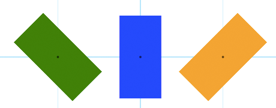

Example:

```text
# Initial State editor
b1 = Block([-20, 0], [20, 10], "green")
b2 = Block([0, 0], [20, 10], "blue")
b3 = Block([20, 0], [20, 10], "orange")

# Calculations editor
b1.rotate(-45, "deg")
b2.rotate(PI/2)
b3.rotate(PI/4)
```

Just as with `Particle` objects, `Block` objects can also be represented with an image by setting the image attribute of the object. The text must be a URI link to a graphic file that can be a PNG, SVG, GIF, or JPEG image.

```text
rocket = Block([0, 0], [10, 10], "purple")
rocket.image = "https://upload.wikimedia.org/wikipedia/commons/3/3d/Spacecraft.png"
```

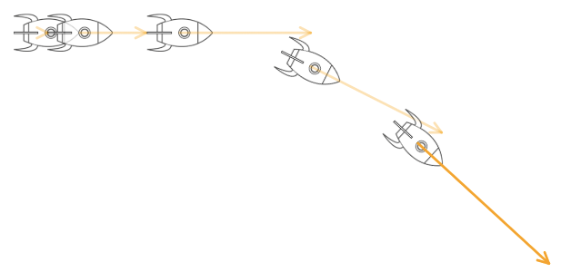


The above image also demonstrates the use of the `direction` function as well as the `rotate` method:

`rocket.rotate(direction(rocket.v))`


#### Block.addLabel\(\)

`Block` objects can also be given a text label. This is similar to the `Label` object.

`block.addLabel(text="Hello", color="green")` — This adds a text label to the `Block` object.

### Spring

You can represent a spring in Tychos using the `Spring` class. A `Spring` is a visual representation of a common elastic connector that displays a given number of coils that dynamically change shape once the dimensions of the  `Spring` are changed in the **Calculations Pane**.

`Spring(pos1=[0,0], pos2=[100, 0], color=default_color, coils=5, width=10, thickness=1)` -&gt; returns a `Spring` object

* `pos1` — The position of one end of the `Spring`. If you don't specify a position, the default value of \[0,0\] is used.
* `pos2` — The position of one other end of the `Spring`. If you don't specify a position, the default value of \[100,0\] is used.
* `color` — The block will be drawn in this color. Use HTML colors e.g. "\#ff3300", "blue".
* `coils` — This is the number of coils represented.
* `width` — This is the width of the coils.
* `thickness` — This is the stroke weight of the coils.

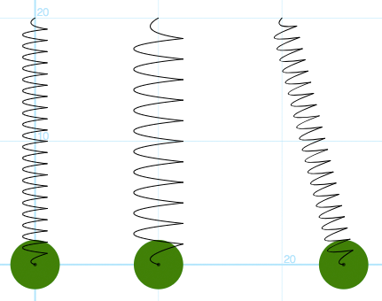

The code below shows the three different `Spring` objects above that have different lengths, widths and coil numbers. The `Particle` objects are shown just for reference.

```text
# Initial State editor
p = Particle([0, 0], 2, "green")
spring = Spring([0, 20], [0, 0], "black", 20, 2)
p = Particle([10, 0], 2, "green")
spring = Spring([10, 20], [10, 0], "black", 10, 4)
p = Particle([20, 0], 2, "green")
spring = Spring([20, 20], [20, 0], "black", 20, 2)
```

These attributes may also be modified after the `Spring` is created. In particular, one will usually change the `pos2` attribute of a Spring in the Calculations editor to show Spring's movement or deformation. 

### Label

You can add text labels to any scenario using the `Label` class. A `Label` has position, width, height and color, similar to a `Block`, but also has a text value. Just like all Tychos objects, you can define how these attributes change in the simulation.

`Label(pos=[0,0], size=[10, 10], text="Hello", color=default_color)` -&gt; returns a `Label` object.

* `pos` — The inital position of your block in \[X,Y\] coordinates. If you don't specify a position, the default value of \[0,0\] is used.
* `size` — The width and height of the block that is drawn in the World View to represent the block.
* `text` - The actual text value of the label.
* `color` — The block will be drawn in this color. Use HTML colors e.g. "\#ff3300", "blue".

These attributes may also be modified after the `Label` object is created. Here is an example of how to make several `Label` objects:

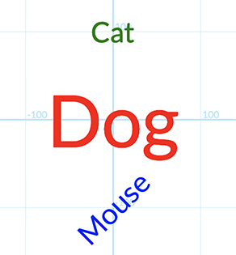

```text
# Initial State editor
label1 = Label([0, 100], [50, 50], "Cat", "green")
label2 = Label([0, 0], [150, 150], "Dog", "red")
label3 = Label([0, -100], [50, 50], "Mouse", "blue")
```

#### Label.rotate

Just as with a `Block` object or a `Particle` object, you can rotate a label as shown above:

```text
label3.rotate(PI/4)
```

## Interface Widgets

Tychos also provides several widgets for displaying data in different ways as well as adding user interactivity so that your simulations can respond to input.

### Graph

A `Graph` is a 2-dimensional chart of data that you specify in the Calculations editor. Each Graph that is created will appear on the right side of the World View. Your program needs to add points to the graph with the `plot`command.

`Graph(title="")` -&gt; Returns a Graph

* `title` = Optional text that will appear at the top of the graph.

#### **Graph.plot**

`graph.plot(x, y, color=default_color)` — Adds a data point to your graph.

Example:

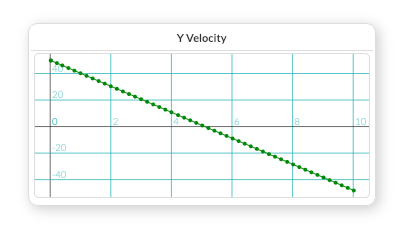

```text
# Initial State editor
g = Graph("Y Velocity")

# Calculations editor
# Graphing a particle projectile's Y velocity
g.plot(t, particle.v[Y], "green")
```

#### Graph.integrate

`graph.integrate(color=default_color)` — When you call the `plot` function of a graph, you create a new plot set. You can then integrate this plot set. This is done by referencing the plot set's color. This returns the calculated area based on the[ **trapezoidal method of approximation**](https://en.wikipedia.org/wiki/Trapezoidal_rule). 

Example:

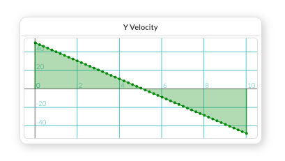

```text
# Initial State editor
g = Graph("Y Velocity")

# Calculations editor
# Graphing a particle projectile's Y velocity
g.plot(t, particle.v[Y], "green")
g.integrate("green")
```

### Meter

A `Meter` is a numeric display of data that you specify in the Calculations editor. Each Meter that is created will appear on the left side of the World View. Your program needs to tell the Meter what value it needs to display by using the `display` command.

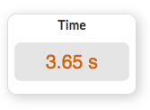

`Meter(title="", color=default_color)` -&gt; Returns a Meter

* `title` = Optional text that will appear at the top of the meter.

#### **Meter.display**

`meter.display(value, units)` — Displays the value on the Meter.

* `value` = Numeric value to be displayed.
* `units` = String representing the unit label to be displayed.

Example:

```text
# Initial State editor
mt = Meter("Time")

# Calculations editor
mt.display(t, "s")
```

### Gauge

A `Gauge` is an analog display of data that is very similar to a `Meter` that you specify in the Initial Sate pane. Each `Gauge` that is created will appear on the left side of the World View.  Gauges also need to to be set up with a specific minimum and maximum value for identifying the range of the `Gauge`. Your program needs to tell the `Gauge` what value it needs to display by using the `display` command.

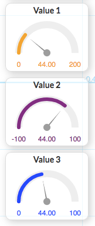

`Gauge(title="", max=100, min=100, color="default_color")` -&gt; Returns a Gauge

* `title` = Optional text that will appear at the top of the Gauge.
* `max` = The maximum value of the Gauge
* `min` = The minimum value of the Gauge

#### **Gauge.display**

`gauge.display(value)` — Displays the value in the Gauge.

Example:

```text
# Initial State editor
g1 = Gauge("Value 1", 200, 0, "orange")
g2 = Gauge("Value 2", 100, -100, "purple")
g3 = Gauge("Value 3", 100, 0, "blue")

# Calculations editor
val = 44
g1.display(val)
g2.display(val)
g3.display(val)
```

## Interactivity

The following section describes different user interface elements that can be used to create interactive simulations in Tychos.

### Toggle

A `Toggle` is an interactive widget that allows you associate a boolean value \(true or false\) with the state of the  `Toggle` widget.

`Toggle(title="")` -&gt; Returns a Toggle

* `title` = Optional text that will appear at the top of the Toggle.

#### **Toggle.value**

`x = toggle.value` — Returns the current value of the Toggle. This is read/write.

Example:

```text
# Initial State editor
t1 = Toggle("My Toggle")

# Calculations editor
isActive = t1.value
```

### Slider

A `Slider` is an interactive widget that allows you to link a value in your scenario to the current value of a horizontal slider.

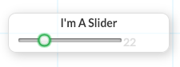

`Slider(title="", min=0, max=100, step=1)` -&gt; Returns a Slider

* `title` = Optional text that will appear at the top of the Slider.
* `min` = The minimum value of the Slider
* `max` = The maximum value of the Slider
* `step` = The step increment of the Slider

#### **Slider.value**

`x = slider.value` — Returns the current value of the Slider. This is read/write.

Example:

```text
# Initial State editor
s1 = Slider("I'm A Slider", 0, 100, 2)

# Calculations editor
x = s1.value
```

### keyboard

The `keyboard` object represents your computers keyboard and has commands to see if any keys are pressed during a simulation.

#### **keyboard.is\_down**

`keyboard.is_down(key)` -&gt; `boolean` — Return 1/0 whether `key` is currently down

#### **keyboard.last\_pressed**

`keyboard.last_pressed(key)` -&gt; `boolean` — was `key` typed? i.e. key was pushed down then released.

### mouse

The `mouse` object represents your computer**'**s mouse.

#### **mouse.pos**

`mouse.pos` -&gt; `vec` — Returns two dimensional vector as a \[X, Y\] matrix representing the position of the mouse in the simulation space.

#### **mouse.is\_down**

`mouse.is_down(button_num=0)` -&gt; `boolean` — Returns whether the mouse button is pressed. `button_num` — Which button to check? 0 = primary button, 1 = secondary, etc.

#### **mouse.is\_over**

`mouse.is_over(object)` -&gt; `boolean` — Returns whether the mouse is positioned over an object that is either a `Particle` or a `Block`. `object` — A simulation object.

## table

The `table` object allows you to create and display rows of data in a table format. The table is viewable in the _Data Output_ tab of the _Hack Panel_.

#### table.setColumns

`table.setColumns(columns=[])` - You must first define the column headings for the table in the Initial State pane. The arguments are simply an array of string values representing the column headings of the table.

#### table.addRow

`table.addRow(row_data=[])` -  Once the table columns have been defined, you then need to define the row data to be added to the table. This is an array of any data type values.

Example:

```text
# Initial State editor
table.setColumns(["time", "x value", "y value"])

# Calculations editor
x = t * 2
y = t / 2
table.addRow([t, x, y])
```

The code above would generate this table:

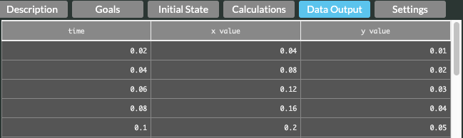

